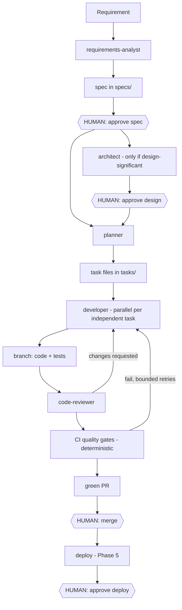

# End-to-End Architecture

## Feasibility & realistic autonomy level

**Feasible now, with honest boundaries.** Current-generation agents reliably handle: requirement analysis, spec drafting, task decomposition, implementation of well-scoped tasks, test authoring, code review, CI triage, and PR preparation. They are *not* yet trustworthy for unsupervised production deployment, destructive operations, or ambiguous product judgment.

Realistic autonomy by lifecycle stage (near-term, this platform):

| Stage | Autonomy | Human role |
|---|---|---|
| Requirements → spec | ~80% autonomous | Approve spec, resolve flagged open questions |
| Planning → tasks | ~95% | Spot-check |
| Architecture | ~70% | Approve significant design decisions |
| Development + tests | ~90% | None until PR |
| Code review | ~85% | Merge decision on green PRs |
| QA / security | ~80% | Review findings |
| Deployment | ~50% | Approve every deploy; agent executes and verifies |
| Monitoring / remediation | ~60% (later phase) | Approve remediations beyond safe runbook actions |

Net effect: humans move from executing every step to ~4 decision points per feature (spec approval, design approval when applicable, PR merge, deploy approval). That is the "judgment, governance, and exception layer" the sponsor described — realistically an **~80% reduction in human touch-time per feature**, not 100% autonomy, and claiming otherwise would be selling.

## The agent team

No super-agent. An orchestrator coordinates eight specialists, each defined as a Claude Code subagent in [.claude/agents/](../.claude/agents/) with a narrow role, restricted tools, and a defined input/output artifact:

| Agent | Input → Output | Tier* |
|---|---|---|
| `requirements-analyst` | Raw requirement → spec draft (with open questions surfaced) | Mid |
| `planner` | Approved spec → task files with dependencies & size labels | Mid |
| `architect` | Spec (when design-significant) → design decision record | Premium |
| `developer` | Task → code + tests on a branch | Mid → Budget later |
| `code-reviewer` | Diff → review verdict + spec-consistency check | Premium |
| `qa-engineer` | Running app + spec acceptance criteria → functional test results, performance smoke results vs budgets, bug tasks | Mid |
| `security-auditor` | Diff / dependency set → findings | Premium |
| `sre` (deferred until something is deployed) | Alerts/logs → diagnosis + runbook remediation or escalation | Mid |

*Tiers per [01-research/model-routing-strategy.md](01-research/model-routing-strategy.md).

## Artifact flow

Agents coordinate through versioned artifacts in the repo, never through implicit shared memory:

Key structural choices:

- **Deterministic gates between stages.** CI (lint, types, tests, coverage, security scan) is the arbiter of "done", not agent self-assessment. Agents iterate against gates; humans only ever see green PRs. See [01-research/tooling-comparison.md](01-research/tooling-comparison.md) §3.
- **Artifact handoffs are load-bearing, not stylistic.** Claude Code subagents start with fresh, isolated context — they never see the parent conversation (official docs, verified 2026-08). A pipeline stage knows exactly what the artifact files (spec, task, design record) tell it. This is why spec/task discipline is an architectural requirement, not process preference.
- **Parallelism where it pays — implementation parallelism used sparingly.** Anthropic's guidance is explicit that most coding tasks parallelize poorly across agents (shared context, inter-task dependencies); the reliable wins are parallel *research* and parallel *review lenses*. So: reviews, QA, and research fan out freely; developer agents run in parallel only for tasks the planner marks truly independent, each in an isolated worktree (`isolation: worktree`), and default to sequential otherwise. Spec and architecture stages stay serial — they're cheap and sequencing-critical.
- **The outer loop follows Anthropic's long-running-harness pattern** ([reference](https://www.anthropic.com/engineering/effective-harnesses-for-long-running-agents)): a feature/criteria list where everything starts "failing", a progress file, a baseline commit, one task per session, and a standing rule that removing or weakening tests is unacceptable.
- **Bounded loops everywhere.** Every agent↔gate loop has a retry ceiling with tier escalation, ending at a human. No unbounded token burn.
- **Traceability by construction.** Spec ID → task IDs → branch name → PR description. Every line of merged code traces to an approved spec.

## Runtime layout

- **Orchestrator:** Claude Code session (interactive during build-out; headless via GitHub Actions for scheduled/triggered runs later).
- **Specialists:** Claude Code subagents (markdown definitions, tool-restricted, versioned in this repo).
- **Budget executors (Week 4+):** OpenRouter-backed models behind a thin task-runner adapter; candidates Hermes Agent / OpenClaw pending the stability spike.
- **State:** the git repo *is* the state store — specs, tasks, branches, PRs, CI results. No separate database until scale demands one.
- **Permissions:** per-agent tool restrictions + Claude Code permission modes + branch protection; detailed in [04-governance.md](04-governance.md).
