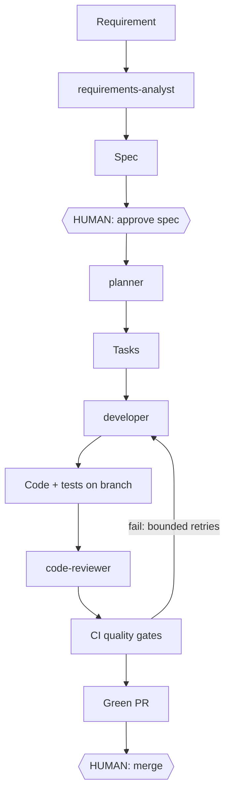

# Agentic Software-Development Platform — R&D Report

**Prepared by:** Hasnat Ahmed · **For:** Hasan Nadeem · **Date:** 2026-08-11 · **Status:** R&D phase complete; POC build phase starting

---

## Executive summary

You asked for an R&D evaluation of a highly autonomous, agentic software-development setup — with a practical recommendation and a working POC, not just a report. The R&D is done and the conclusion is positive: **this is feasible today, the industry has already converged on the architecture we're proposing, and we can build it incrementally on tools we already have.**

The recommendation in one paragraph: an **orchestrator coordinating seven specialized agents** (requirements, planning, architecture, development, review, QA, security) built on **Claude Code**, coordinating through a **lightweight spec-driven core** (one-page specs, human-approved), with **deterministic CI quality gates** (lint, types, tests, coverage, mutation testing, security scans — gates are code, not model opinions), **tiered model routing** for cost (premium models only where judgment matters; budget models like DeepSeek V4 via OpenRouter for routine execution), and **six mandatory human approval points**. Humans move from executing every step to ~4 decisions per feature — a realistic **~80% reduction in human touch-time**, not a fantasy of 100% autonomy.

Every major claim in this report was validated against current industry sources in a six-track web-research pass (2026-08-06/07) with full citations — see [01-research/validation-2026-08.md](01-research/validation-2026-08.md). Notably, the research *changed* two of our positions (Hermes/OpenClaw ruled out; pricing corrected) — the process works.

**Deliverable status against your original request:** items 1–9 complete and validated ✅; item 10 (working POC) is the build phase, scheduled Weeks 2–3.

## 1. Feasibility & realistic autonomy level

Feasible now, with honest boundaries. Current agents reliably handle: requirement analysis, spec drafting, task decomposition, implementation of well-scoped tasks, test authoring, code review, CI triage, PR preparation. They are *not* yet trustworthy for unsupervised production deployment or ambiguous product judgment. Independent evidence agrees: Cognition's own Devin retrospective reports a 67% PR merge rate with a sweet spot of "clear, verifiable 4–8 hour tasks" and failure on ambiguity — matching our design assumption that specs and scoping, not raw model power, decide success.

| Stage | Autonomy | Human role |
|---|---|---|
| Requirements → spec | ~80% | Approve spec, resolve flagged questions |
| Planning → tasks | ~95% | Spot-check |
| Architecture | ~70% | Approve significant designs |
| Development + tests | ~90% | None until PR |
| Code review | ~85% | Merge decision on green PRs |
| QA / security | ~80% | Review findings |
| Deployment | ~50% | Approve every deploy |
| Monitoring / remediation | ~60% (later) | Approve beyond-runbook actions |

## 2. Proposed end-to-end architecture

No super-agent — an orchestrator (Claude Code) coordinates seven specialists, each a version-controlled agent definition with a narrow role, restricted tools, and an assigned model tier. Agents coordinate **through artifacts in the repo** (spec → tasks → branches → PRs), never through shared conversation — which research confirmed is an architectural requirement of the platform, not a style choice.

The validation research found the industry converged on exactly this loop: GitHub Copilot coding agent, Google Jules, Devin, OpenAI Codex, and OpenHands all ship *issue in → sandboxed agent → PR out → CI gates → human review*. We are building the consensus architecture, not betting on an exotic one.

## 3. Spec-driven development: adopt — but lightweight

**Verdict: yes, as a lightweight core; heavyweight SDD is rejected with evidence.** One-page spec per non-trivial feature, agent-drafted, human-approved, serving as the contract between pipeline stages. A size threshold keeps ceremony off small changes (trivial → no spec; small → 3-line micro-spec; feature → full spec).

Why it earns its place in an *agent* pipeline specifically: agents coordinate only through artifacts; specs move human judgment to the cheapest point (5 minutes before implementation vs 40 minutes reviewing a wrong PR); traceability (spec → task → PR) falls out for free; and tight specs are what make cheap-model routing safe. Field evidence: the heavyweight alternative measurably fails (a CTO's hands-on test of GitHub Spec Kit ran ~10× slower than iterative development; Thoughtworks reached the same verdict), while the lightweight one-pager matches the pattern practitioners independently converged on. Honesty note: no controlled study exists either way — our own pipeline metrics will be the real test, and the spec threshold gets tuned by data in Weeks 5–6.

## 4. Tools, frameworks & executors — comparison verdicts

| Option | Verdict | Why |
|---|---|---|
| **Claude Code** (subagents, hooks, headless CI) | **Chosen** | Zero build cost, already licensed; orchestration/permissions/sandboxing exist today; official GitHub Actions path; our subagent format verified against current docs. Graduates cleanly to the Agent SDK later. |
| LangGraph | Not now | Production-proven (Uber, ~400 companies) but its SDLC use is bespoke tooling built by dedicated platform teams — wrong layer at our scale. Credible future option for multi-day durable workflows. |
| CrewAI / AutoGen | Rejected | AutoGen: maintenance mode since Oct 2025. CrewAI: traction is business-process automation, not SDLC; last on production reliability in 2026 comparisons. |
| Temporal | Deferred indefinitely | Used by vendors running agent *products* at massive scale (OpenAI, Replit); no credible small-team dev-pipeline usage. |
| **Hermes Agent / OpenClaw** | **Ruled out** (changed by research) | OpenClaw: personal-assistant harness with a disqualifying security record — tens of thousands of exposed instances leaking credentials, a 770k-agent breach, 800+ malicious marketplace skills, CVSS 8.8 prompt-injection CVE; its creator calls it a hobby project. Hermes Agent: real and popular but ~5 months old, weekly breaking changes, unresolved governance concerns. Neither gets repo write access. |
| **OpenHands** (+ aider fallback) | **Spike target, Week 4** | The credible open-source executor for budget models: Docker-sandboxed, headless/CI mode, ~72% SWE-bench Verified, enterprise RBAC. Its Issue Resolver action already implements our exact loop. |

## 5. Model routing: speed, quality, cost

Route every task to the cheapest tier that passes gates first-time. Prices verified 2026-08-06:

| Tier | Models | $/M tokens (in/out) | Used for |
|---|---|---|---|
| Premium | Claude Opus 5 | $5 / $25 | Architecture, code review, security, escalations |
| Mid | Claude Sonnet 5 | $3 / $15 | Specs, planning, implementation (default) |
| Budget | DeepSeek V4 Flash, Qwen3-Coder-Next, Kimi K2.7 Code (OpenRouter) | $0.06–0.70 / $0.18–3.50 | Routine implementation, boilerplate, test scaffolds, summaries |

The budget tier changed character this year: the best budget models now score 78–81% on SWE-bench Verified — Claude Sonnet 4.6-class quality at 1/10th–1/80th the output price. Published routing results report 40–85% cost reductions at held quality. Two safety rules from the research: **eval gates before traffic** (measure a budget model on our benchmark tasks before routing real work to it), and **automatic escalation** (two gate failures → escalate one tier; premium failure → human). Estimated cost per small-to-medium feature after routing: **$3–5**, vs $10–20 all-premium.

## 6. Security, permissions & production-risk controls

- **Least privilege per agent**: tool allowlists in each agent definition; only the developer writes code; nobody merges.
- **Deterministic enforcement**: protected-file rules (CI configs, secrets, agent definitions) enforced by Claude Code `PreToolUse` hooks — which are binding, unlike prompt instructions.
- **Branch protection as fact, not convention**: agents open draft PRs only; CI workflows on agent pushes require human approval to run; approvals from whoever prompted the agent don't count (both rules adopted from GitHub's own agent controls).
- **Gate stack hardened against known agent failure modes**: mutation testing added because agents demonstrably game coverage metrics with assertion-free tests; security scanning is a floor, not a ceiling (LLM-code security pass rates are stalled ~56% industry-wide — so the security-auditor agent reviews input-handling and dependency changes from Week 3).
- **Performance testing as a gate, not an afterthought**: specs carry performance budgets (p95 latency, throughput) as acceptance criteria; from Week 5–6 a k6/autocannon smoke suite enforces them in CI — a perf regression fails the gate like a failing test. Deeper load testing arrives with the staging environment.
- **Secrets never touch agents**: deploys run in CI with platform-managed secrets after human approval; scoped rotated tokens elsewhere.
- **Bounded everything**: every retry loop has a ceiling ending at a human; a kill switch stops all scheduled agent runs.

## 7. Mandatory human approval points

Six, and only six — everything else is autonomous by design:

1. **Spec approval** — "is this the right thing to build?" (the highest-leverage 5 minutes)
2. **Design approval** — design-significant features only
3. **PR merge** — always human; agents technically cannot merge
4. **Every deployment** — each environment, until a track record justifies auto-staging
5. **Spend above threshold** — runs projected >$10; new budgets → sponsor
6. **Production remediation beyond pre-approved runbook** — SRE agent may restart/scale/rollback; anything else pages a human

## 8. Roadmap (phased, iterative — 70% fast over 100% slow)

- **Week 1 ✅ (done)**: repo + full R&D docs + 7 agent definitions + governance + web-validation pass with corrections applied
- **Week 2**: POC stage 1 — requirement → spec → tasks live on the sample app, human approval gate exercised
- **Week 3**: POC stage 2 — developer + reviewer agents produce code + tests on branches; full CI gate stack; **first fully agent-generated PR** (completes your POC deliverable)
- **Week 4**: demo + metrics baseline; benchmark budget models via OpenRouter; OpenHands spike; wire routing for task types that pass
- **Weeks 5–6**: security-auditor + QA agent join; performance smoke tests with budgets become a CI gate; second full run to prove repeatability; tune thresholds with data
- **Week 7+**: onboard 1–2 devs as pipeline operators; headless issue-triggered runs; staging deploy agent; then monitoring/SRE agent

## 9. Costs

- **POC (Weeks 2–4)**: interactive work covered by existing Claude Code subscription. Real spend: **~$25–50 OpenRouter credit** (budget-model benchmarking) + **~$5–20** headless CI runs (metered per-token since June 2026). **Total ask: under $75.**
- **Scaled operation (planning estimate)**: at ~40 agent-built features/month with routing ≈ **$120–240/month inference** + CI minutes. The real ROI lever is human hours per shipped feature, not the inference bill — but routing discipline compounds at scale.

## 10. Success metrics (collected per feature from Week 2)

| Dimension | Metric | POC target | Platform target |
|---|---|---|---|
| Speed | Requirement → merged PR | < 1 day | < 4 h |
| Speed | Human touch-time per feature | < 30 min | < 15 min |
| Quality | First-pass gate rate | > 60% | > 85% |
| Quality | Mutation score on changed code | > 50% | > 70% critical paths |
| Autonomy | Steps with zero human edits | > 70% | > 90% |
| Cost | Inference per merged feature | < $10 | < $6 |

The composite that decides success: **human hours per shipped feature at equal-or-better defect rate.** If Week 4's demo can't show it moving, we re-plan before building more.

## How this was validated

Six parallel research tracks (2026-08-06/07): spec-driven development in practice, Claude Code official guidance, orchestration landscape, Hermes/OpenClaw security assessment, model pricing/benchmarks, CI gates for AI-authored code. Every claim source-cited with URL and date in [01-research/validation-2026-08.md](01-research/validation-2026-08.md). The research corrected us twice (executor harnesses, pricing) and confirmed the rest — the docs are now evidence, not opinion.

## Decisions needed from you

1. **Approve ~$75 POC budget** (OpenRouter credit + CI metering) so Week 4's cost benchmarking can run.
2. **Repo location**: personal private repo now and migrate at team onboarding, or create in the company GitHub org today so Tehreem/Yousaf can follow directly.

Everything else is in motion: next milestone is the Week 3 demo — a requirement entering the pipeline and exiting as a tested, reviewed, green pull request with humans touching exactly two gates.
